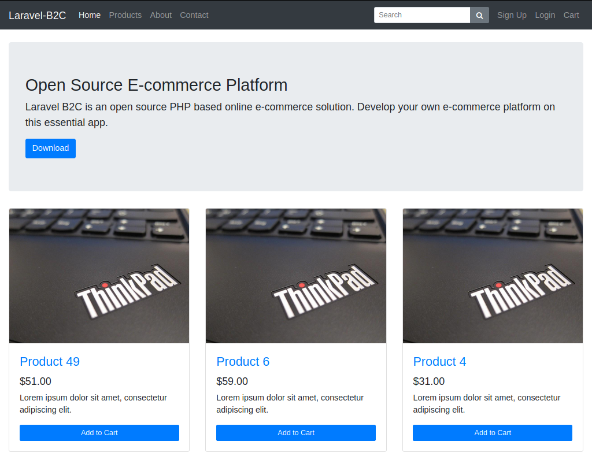
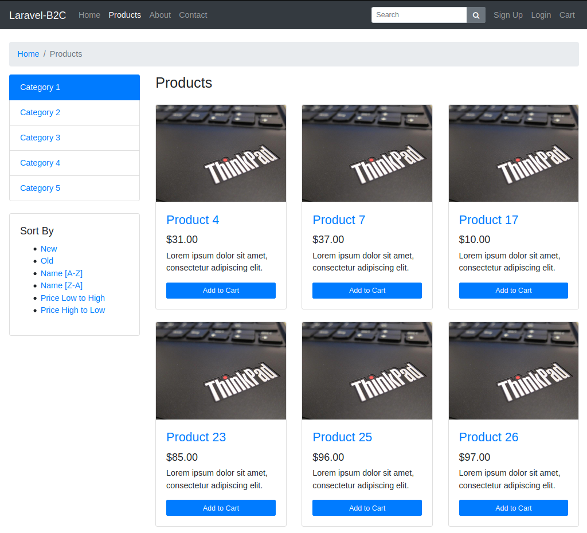
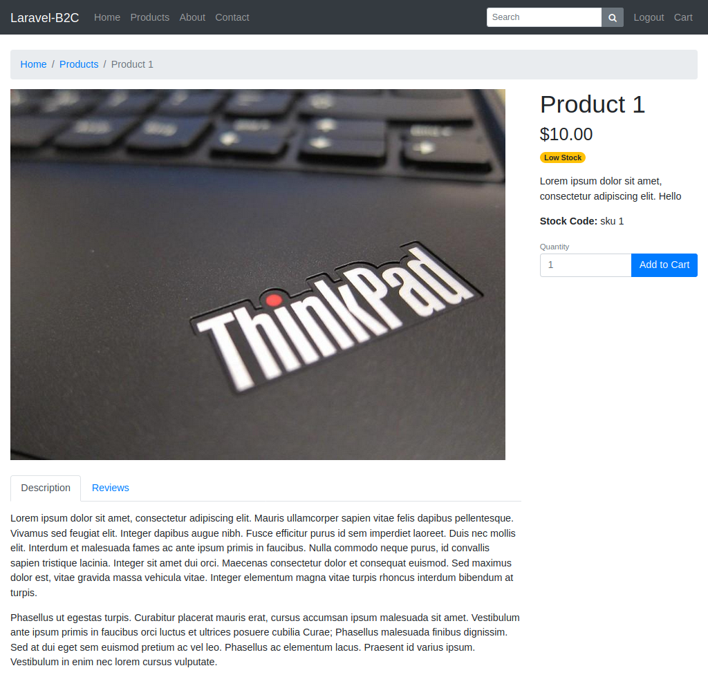
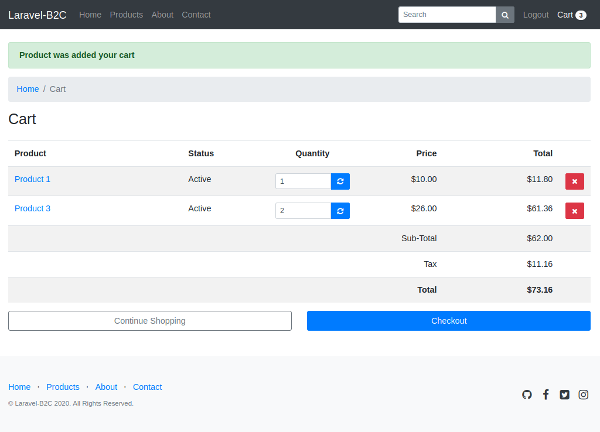
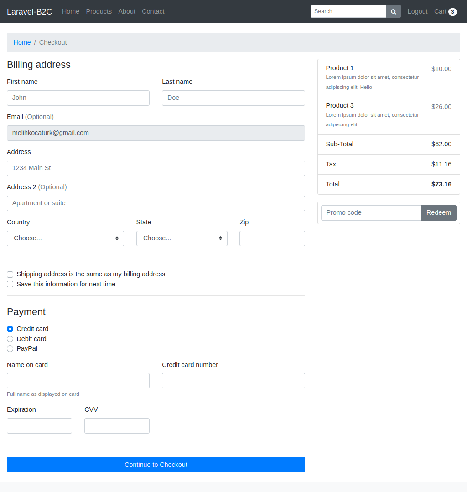

# Laravel-B2C

Laravel B2C is an open source PHP based online e-commerce solution. Develop your own e-commerce platform on this essential app.

## Open Source E-commerce Platform

* Bootstrap 4
* Shopping Cart
* Search
* Checkout
* Promo Code
* [Voyager Admin](https://github.com/the-control-group/voyager)

## Installation

### 1. Get the Code
Clone this repository:
```
git clone https://github.com/melihkocaturk/laravel-b2c.git
```

### 2. Create a new database
Create a new database and add your database credentials to your .env file:
```
DB_HOST=localhost
DB_DATABASE=laravel-b2c
DB_USERNAME=laravel-b2c
DB_PASSWORD=password
```

### 3. Build database schema
```
php artisan migrate --seed
```
### 4. Install Voyager

Documentation available from https://voyager-docs.devdojo.com/getting-started/installation.

Add "stock_threshold" setting when installation is complete.

## Preview











